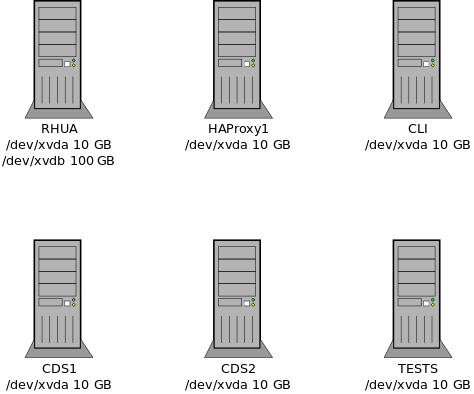

# RHUI 5 automation - scripts

## Create Stack script

This script creates EC2 instance machines (m5.large) according to default or specified options.

Instances are named `$user_$fstype_$name_$role` (*user_nfs_50_rhua*)

The script produces an output config file suitable for the RHUI 5 Ansible installation. [Example](#output-configuration-file) of the output file. The default name of the file is `hosts_$fstype_$name.cfg` (*hosts_nfs_50.cfg*)

A new security group is created. Its name contains the stack ID.

Inbound rules:

  ```
  22 TCP (SSH)
  443 TCP (HTTPS)
  2049 TCP (NFS)
```

### Requirements

* AWS credentials in `~/.aws/credentials`, created by running `aws configure`
* A YAML config file with VPC information - default path is `/etc/rhui_ec2.yaml` [(example)](#input-configuration-file)
* Up-to-date lists of AMIs in `*mapping.json` files - the files should be up to date in Git, but you can regenerate them locally with the `scripts/get_amis_list.py` script
* Boto3 for your Python version; install it using your distribution's package manager, e.g. `dnf install python3-boto3`
* SSH configuration (in `~/.ssh/config`) with the user name and private key for EC2 machines, for example:

```
Host *.amazonaws.com
    User ec2-user
    IdentityFile ~/.ssh/rhatter
```

Note: if you use your common keypair in EC2, you needn't have the `IdentityFile` line.
The key from the `~/.ssh/id_rsa` file will be used automatically.

See also the note below the yaml config file example regarding the user name and key.

### Usage

Run `scripts/create-cf-stack.py [optional parameters]` [(example)](#usage-example)

Default configuration: 
  * RHEL 9 instances
  * eu-west-1 region
  * instances: 1x launchpad (a helper VM that the installer is launched from), 1xRHUA (+NFS), 1xCDS, 1xHAProxy

#### Main parameters

  * **--name [name]** - common name for the instances in the stack (as in $user_$fstype_$name_$role); also affects the `hosts` file name (unless overridden). `default = rhui`
  * **--cds [number]** - number of CDS machines, `default = 1`
  * **--cli7/8/9/10 [number]** - number of CLI machines, `default = 0`, use `-1` to get machines for all architectures (one machine per architecture)
  * **--cli-all** - get client machines for all RHEL versions
  * **--cli7/8/9/10-arch [arch]** - CLI machines' architectures (comma-separated list), `default = x86_64 for all of them`, `cli`_N_ set to `-1` will populate the list with all architectures automatically, so this parameter is unnecessary then
  * **--test** - if specified, TEST machine running RHEL 8, `default = 0`
  * **--region [name]** - `default = eu-west-1`
  * **--ansible-ssh-extra-args [args]** - optional SSH arguments for Ansible
  * **--novpc** - use EC2 Classic, not VPC; possibly useful if you're short on Elastic IPs

Run the script with `-h` or `--help` to get a list of all parameters.

If you specify a non-x86\_64 client architecture, a suitable instance type will be selected
automatically. You cannot use EC2 Classic with some instance types,
e.g. with t4g.micro, which will be selected for arm64. If you use `--novpc` and request an arm64
client, the script will inform you about this incompatibility and quit.

 
Other options:
  * **--debug** - debug info

### Configuration

If there is a separate NFS machine, an extra 100 GB volume is attached to this machine. If not, an extra 100 GB volume is attached to the RHUA machine.



### Examples

#### Usage example

* `scripts/create-cf-stack.py`
  * basic configuration
  * 1xRHUA=NFS, 1xCDS, 1xHAProxy
* `scripts/create-cf-stack.py --region eu-central-1 --nfs cli9 2 --haproxy 2 --name rhui50wip`
  * configuration in the eu-central-1 region
  * 1xRHUA, 1xNFS, 2xCLI9, 2xHAProxy
* `scripts/create-cf-stack.py --cds 2 --cli9 1 --cli10 1 --input-conf /etc/rhui_amazon.yaml --output-conf my_new_hosts_config_file.cfg --name cdsdebug`
  * 1xRHUA=NFS, 2xCDS, 1xCLI9, 1xCLI10, 1xHAProxy
* `scripts/create-cf-stack.py --input-conf rhui_ec2.yaml --name rhel8clients --cli8 -1 --test --vpcid vpc-012345678 --subnetid subnet-89abcdef`
  * custom input configuration file in the current working directory
  * 1xRHUA=NFS, 1xCDS, 1xHAProxy, 2xCLI8 (x86_64 and ARM64), 1xTEST, overridden VPC and subnet configuration

#### Input configuration file

Create `/etc/rhui_ec2.yaml` from the following template.

```
ssh:
  ap-northeast-1: [rhatter-ec2-overrides, /home/rhatter/.ssh/rhatter-ec2-overrides.pem]
vpc:
  eu-west-1: [vpc-333, subnet-aaa]

```

Change the VPC and subnet IDs and add them for any other regions you might use.

Note: in this example, a special key pair name and private key file path are specified
for the `ap-northeast-1` region. In that case, the script will use this information
in the generated inventory file so that Ansible can use it when connecting to the machines.
**This key pair name and the corresponding public key must exist in the given AWS region.**
For other (undefined) regions, the inventory file won't contain such information, and Ansible
will honor the saved or default SSH configuration as decribed in the Requirements section.
At the same time, the stack creation script will use your local user name as the AWS key pair
name unless you override it using the `--key-pair-name` option.
It is therefore wise to keep the same key pair in all regions, and name it according to your
local user name. Then you won't need the `ssh` section in the input configuration file at all.

#### Output configuration file

The output configuration file is needed for the RHUI 5 installation orchestrated by Ansible.

Examples of the output file are in the [deployment README](../deploy/README.md) file,
or see the [hosts.cfg](../hosts.cfg) file in the parent directory.

### RHUI cloning

The RHUI 5 installer can clone an existing RHUA. To test this feature, create a stack with a VM
reserved as the future clone by using the `--clone` option of the `create-cf-stack.py` script.
Then deploy RHUI on the stack; the reserved VM will be left intact at this point. Use the original
RHUA as you wish.

To test the cloning process, rerun the `deploy.py` script with the `--clone` option. The script
will set the reserved VM up as another RHUA, copy the remote share, and rerun the installer to
clone the original RHUA to the other VM.

### How to delete stack

Stack can be deleted "all in one" with CloudFormation. On the AWS amazon web page go to the
CloudFormation service, click on the stack, and click on Delete. Or use the AWS CLI:

```
aws cloudformation delete-stack --stack-name <NAME>
```

The stack is deleted with all its instances, volumes, elastic IPs, and the security group.
